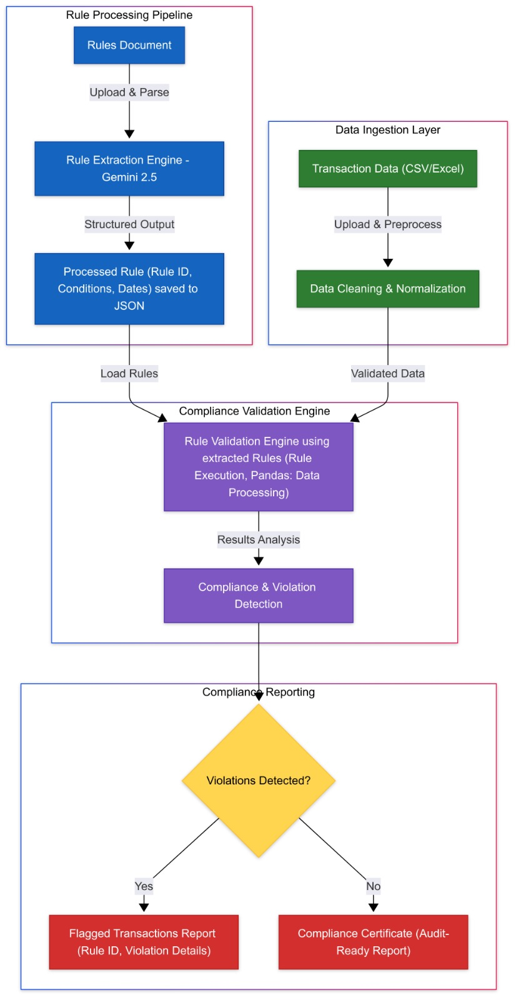

# 🚀 Project Name

## 📌 Table of Contents

- [Introduction](#introduction)
- [What It Does](#what-it-does)
- [How We Built It](#how-we-built-it)
- [How to Run](#how-to-run)
- [Tech Stack](#tech-stack)
- [Team](#team)

---

## 🎯 Introduction

This project extracts, interprets, and refines regulatory reporting instructions to identify key data validation requirements. It ensures compliance with financial regulations by automating the identification of data quality issues before submission. The system helps reduce manual effort, minimize reporting errors, and improve the consistency of regulatory filings.

Key features include:

- A JSON file defining validation rules for each column and allowable values.

- A sample dataset adhering to the defined schema.

- A Python script to validate the dataset against the rules.

- Comprehensive error reporting and logging to facilitate troubleshooting.

- Extensible rule definitions, allowing new regulatory requirements to be incorporated seamlessly.

🖼️ Screenshots:
### Generate rules page

### Validate rules page


# Architecture Diagram


## ⚙️ What It Does

This solution automates the tedious process of manually reading regulatory documents and verifying data compliance. Here's how it works:

### Key Features:
1. **PDF Parsing & Rule Extraction**: 
   - Extracts text from PDF documents using PyPDF2
   - Utilizes AI (Gemini API) to generate initial rules from unstructured text
   - Creates a structured JSON schema from the extracted rules

2. **Data Validation Engine**: 
   - Validates CSV data against the JSON schema rules
   - Provides detailed error reporting for non-compliant data
   - Uses pandas for efficient data processing

3. **Stress Tested for Performance**: 
   - Handles datasets ranging from 11 to 110,000 rows
   - Optimized for both speed and memory usage
   - Linear scalability in processing time

4. **User-Friendly Interface**: 
   - React-based frontend for easy file uploads
   - Real-time validation results display
   - Intuitive UI for non-technical users

### Automation Flow:
1. **PDF Processing**:
   - Upload a regulatory PDF document
   - System extracts relevant text and uses AI to identify key rules
   - Automatically converts these rules into a JSON schema

2. **Rule Application**:
   - Users upload CSV data files
   - System validates data against the JSON schema rules
   - Provides detailed validation results

3. **Continuous Improvement**:
   - Easily update rules by processing new PDF documents
   - Extendable schema allows adding new validation rules
   - Maintains complete audit trail of validations

This system significantly reduces the manual effort required to:
- Read and interpret lengthy regulatory documents
- Manually cross-check data against compliance rules
- Generate and maintain validation rules

The automation not only speeds up the process but also reduces human error and ensures consistent application of regulatory requirements.

## 🛠️ How We Built It

1. **Parsing Large PDF Files**  
   We used PyPDF2 to extract text from large PDF files and the Gemini API through Google's generative AI endpoints to process the content and generate initial rules.

2. **Rule Generation & Engine**  
   Our system creates a JSON schema-based rules engine that can dynamically accept and validate rules. The engine uses jsonschema for validation and pandas for efficient data processing.

3. **Scalable Processing**  
   The core validation logic is optimized using pandas for fast data manipulation. We implemented async operations in FastAPI to handle multiple requests efficiently.

4. **API Development**  
   Built with FastAPI, our backend provides endpoints for file validation and schema management. The API is designed to be lightweight and fast, with proper error handling.

5. **User Interface**  
   A React frontend provides an intuitive interface for uploading files and viewing results. The UI is optimized for performance using React components.

6. **Integration & Bundling**  
   The application is containerized and bundled using modern JavaScript packaging, making it easy to deploy as a single application.

Key Technologies Used:
- **Backend:** FastAPI for high-performance API handling
- **Frontend:** React for component-based UI
- **Data Processing:** pandas for efficient data manipulation
- **Validation:** jsonschema for schema validation
- **PDF Processing:** PyPDF2 for text extraction
- **AI Integration:** Google's Gemini API for rule generation

## 🚧 Challenges We Faced
1. **Difficulty in Parsing Large Files:** One of the primary challenges was effectively parsing very large files. Large Language Models (LLMs) face issues when dealing with such large data. It is essential to parse this extensive information without losing crucial details, which demands sophisticated methods and technologies.
2. **Test Data Generation:** Another major hurdle was the generation of test data that accurately reflected real-world scenarios. This process was complex as it needed to ensure the test data was comprehensive and representative, allowing us to thoroughly validate our solutions and predict potential issues.
3. **Rule Generation from Data:** Creating rules from the collected data was also a challenging task. This required deep analysis and understanding of the data patterns to develop accurate rules that could support decision-making processes and enhance system functionality.

## 🏃 How to Run

1. Clone the repository  
   ```sh
   git clone https://github.com/your-repo.git
   ```

2. Install Python dependencies for the FastAPI backend:
   ```sh
   cd code/src
   pip install -r requirements.txt
   ```

3. Install Node.js dependencies for the React frontend:
   ```sh
   cd ../ui
   npm install
   ```

4. Start the FastAPI backend:
   ```sh
   cd ../../code/src
   uvicorn api:app --reload
   ```

5. In a separate terminal, start the React frontend:
   ```sh
   cd ../ui
   npm start
   ```

Note: Make sure you have Python and Node.js installed on your system before running these commands. The backend runs on port 8000 and the frontend runs on port 3000.

## 🏗️ Tech Stack
- 🔹 Frontend: React 
- 🔹 Backend: FastAPI
- 🔹 Database: 
- 🔹 Other: OpenAI API

## 📈 Scalability
Our solution is designed with scalability in mind, using FastAPI for high-performance backend processing and React for efficient frontend rendering. The system demonstrates linear scalability in both processing time and memory usage as shown in our stress test results below.

```
Starting stress test...
--------------------------------------------------------------------------------
Base dataset rows: 11
Using schema: /Users/ashish/Desktop/Projects/gaidp-indecision-trees/code/src/cre-json-schema.json
--------------------------------------------------------------------------------

Simulating dataset with 11 rows...
  Completed in 0.0059 seconds
  Memory usage: 0.12 MB
  Processed rows: 11
  Valid rows: 5
  Invalid rows: 6

Simulating dataset with 110 rows...
  Completed in 0.0343 seconds
  Memory usage: 0.06 MB
  Processed rows: 110
  Valid rows: 50
  Invalid rows: 60

Simulating dataset with 1100 rows...
  Completed in 0.3309 seconds
  Memory usage: 0.41 MB
  Processed rows: 1100
  Valid rows: 500
  Invalid rows: 600

Simulating dataset with 11000 rows...
  Completed in 3.3055 seconds
  Memory usage: 8.58 MB
  Processed rows: 11000
  Valid rows: 5000
  Invalid rows: 6000

Simulating dataset with 110000 rows...
  Completed in 34.4670 seconds
  Memory usage: 54.88 MB
  Processed rows: 110000
  Valid rows: 50000
  Invalid rows: 60000

Stress test completed.
```

## 👥 Team
- **Pravanya Amirishetty** - [GitHub](#) | [LinkedIn](#)
- **Deepak R. Naik** - [GitHub](#) | [LinkedIn](#)
- **Vignesh Srinivasan** - [GitHub](#) | [LinkedIn](#)
- **Ashish Reddy** - [GitHub](#) | [LinkedIn](#)
- **Atreya Majumdar** - [GitHub](#) | [LinkedIn](#)
